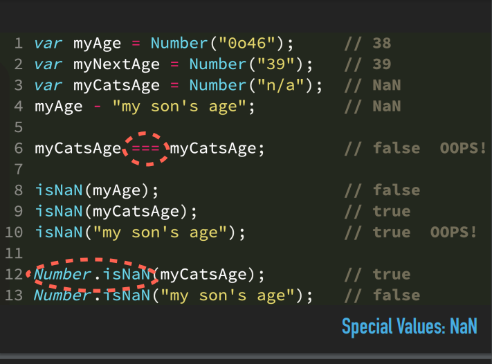

# NaN And IsNaN
---

> **NaN** => Most of the people thing the NAN is a (Not a Number) but the accual thing is this is (**Invalid Number**)

> **IsNaN** => is the thing that check the value is a (**Invalid Number**) or Not

> Here are some Examples

> **console.log(NaN == NaN) ;** // false   // when you check NaN with the strict equality this will say NaN is not a Equal with NaN 

> **console.log(NaN === NaN) ;** // false  // when you check NaN with the loose equality this will say NaN is not a Equal with NaN 

> **console.log(Object.is(NaN,NaN)) ;**  // true // when you check this with Object.is then it will say true this is beouse Object.is check very strictly that the element is equal or not